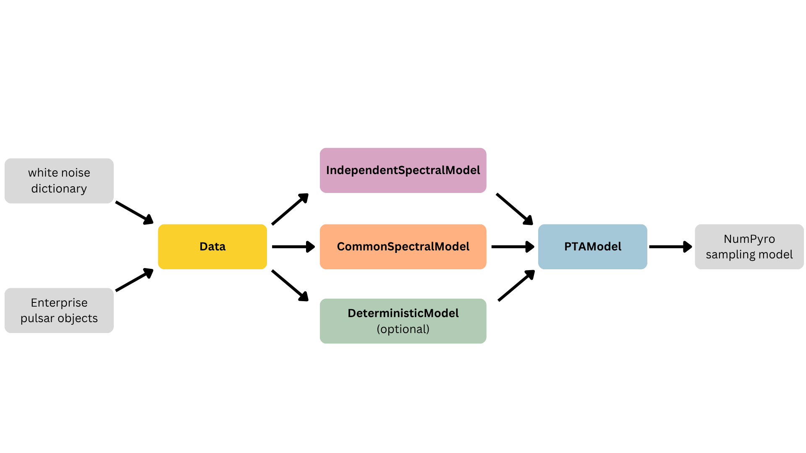

# Prometheus

_Prometheus_ is a fast pulsar timing array analysis package which supports common models for intrinsic pulsar noise and a stochastic gravitational wave background. Deterministic signals are supported, so fast fully joint analyses may be performed.

On a NVIDIA GeForce RTX 3090, parameter estimation on the NANOGrav 15-year data set takes ~15 minutes!

The posterior density sampled in **Prometheus** is equivalent to that of the [Enterprise](https://github.com/nanograv/enterprise) software. However, in implementation they differ in three ways:

1) The Fourier coefficients representing stochastic timing delays are directly sampled in **Prometheus**, rather than integrated from the model. That is, they are numerically marginalized over instead of analytically marginalized.

2) The Fourier coefficients are sampled under a standardizing coordinate transform, so they approximately obey a standard normal distribution.

3) Deterministic signals are represented in a Fourier basis (under the hood) to retain a hyper-efficient posterior formulation.

The posterior is implemented in [JAX](https://jax.readthedocs.io/en/latest/) which supports JIT and automatic differentiation methods. The posterior sampling is performed using [NumPyro's No U-Turn Sampler](https://num.pyro.ai/en/stable/mcmc.html#id7).

## Installation

This package is hosted in a **private GitHub repository** under the `XGI-MSU` organization. You must be invited via email or GitHub username to access the repository.

Install directly with pip using SSH:

```bash
pip install git+ssh://git@github.com/XGI-MSU/prometheus.git
```

or install using a GitHub
Personal Access Token (PAT):

```bash
pip install git+https://<TOKEN>@github.com/XGI-MSU/prometheus.git
```

## Requirements & Conventions

**Prometheus** requires a modern Python with standard packages, including `enterprise`. The analysis should be executed on a NVIDIA GPU with [CUDA-enabled JAX](https://docs.jax.dev/en/latest/installation.html).

By default, single precision (`float32`) is used. To accomodate this choice, timing residuals use units of _nano-seconds_. Any custom models supplied by the user need to be stable in single precision, JAX compatible, and use base units of nano-seconds. See functions in `spectra.py` and `deterministic.py` for examples.

If desired, double precision (`float64`) can be used by modifying `__init__.py`, but this slows down the analysis.


## Examples

The `examples` folder contains a variety of example analyses in interactive Python notebooks.

- `gwb_pe.ipynb` reproduces (some) results from the NANOGrav 15-year stochastic analysis.

- `cw_pe.ipynb` reproduces (some) results from the NANOGrav 15-year continuous wave analysis.

- The `advanced_modeling` folder contains examples illustrating the construction and sampling of more complicated models.

## Data structure (`data.py`)

**Prometheus** stores PTA data in a custom `prometheus.data.Data` object. This object may be constructed from a list of `enterprise.pulsar.PintPulsar` (or `FeatherPulsar`) objects and a standard white noise dictionary.

Besides common PTA attributes (number of pulsars, sky locations, etc.), the `Data` object also stores constants used for the evaluation of the posterior (e.g. "TNT", "TNr", etc.).

## Signal and noise models

The white noise model is fixed throughout the analysis. Linear deviations to the reference parameters of the pulsar timing model are analytically marginalized.

### Stochastic spectral models (`spectral_models.py`)

Pulsar noise and gravitational wave background signals are modeled using a set
of Fourier coefficients with zero-mean multivariate normal priors (i.e. Gaussian
processes).

The prior covariance of these coefficients may be parameterized by an arbitrary
hyper-spectral model. However, the current version of **Prometheus** does not
support inter-frequency correlations: prior covariance matrices must be
diagonal in Fourier space for each pulsar. Inter-pulsar correlation (e.g. Hellings-Downs) are supported.

Pulsar noise models are most naturally represented by instances of
`prometheus.spectral_models.IndependentSpectralModel`. This assumes that all pulsars use the same (statistically independent) noise model, e.g. a power law.

Gravitational wave background models are most naturally represented by
instances of `prometheus.spectral_models.CommonSpectralModel`. This assumes a common spectrum across all pulsars, consistent with a specified inter-pulsar correlation pattern.

More general spectral models—not fitting in the categories above—can be implemented using the `prometheus.spectral_models.SpectralModel` class. While this option offers maximum
flexibility, constructing a `SpectralModel` typically requires more effort; see
the `advanced_modeling` example notebooks.


### Deterministic Models (`deterministic_models.py`)

Arbitrary deterministic models are represented with an instantiation of a `prometheus.deterministic_models.DeterministicModel` object.

While arbitrary deterministic models are architecturally "supported", satisfactory sampling for every model cannot be guaranteed. Chain convergence and sampling diagnostics should always be checked!

See the `tests` folder where `float32` stability and the Fourier representation of an example deterministic signal is demonstrated.


## PTA Models (`pta_model.py`)

The `prometheus.pta_model.PTAModel` class contains the constituent signal and noise models. It builds a NumPyro probabilistic sampling model and posterior samples can be obtained via NumPyro's NUTS implementation.

A `PTAModel` can be constructed in one of two operational modes:

1. **Standard mode**  
   The user supplies:
   - an `IndependentSpectralModel`, and
   - a `CommonSpectralModel`.

2. **Custom mode**  
   The user supplies a single `SpectralModel` that fully specifies the PTA
   spectral structure.

**Standard mode** is recommended for simpler analyses, for example when all
pulsars share the same independent noise model and the gravitational-wave
background has fixed inter-pulsar correlations.

**Custom mode** provides greater flexibility, but constructing a
`SpectralModel` typically requires more user effort.

In both standard and custom modes, an optional `DeterministicModel` may be
included when constructing a `PTAModel`.

Prometheus' **standard** mode is illustrated below.


## Priors

- The Fourier coefficients use zero-mean multivariate normal priors.

- If included in deterministic models, the pulsar distance parameters use normal priors.

- All other parameters (e.g. those of spectral and determinstic models) use uniform priors over the bounds specified by the user. If a sampled parameter is logarithmic (e.g. $\log_{10}\mathcal{M}$), the uniform prior implies a log-uniform prior over the base parameter ($\mathcal{M}$).

- To alter priors, users may supply an `additional_ln_factor` function as input to the to desired model (e.g. `IndependentSpectralModel`, `CommonSpectralModel`, `DeterministicModel`). This function adds a natural-logarithmic term to the posterior evaluation. See examples in the `advanced_modeling` folder. 
